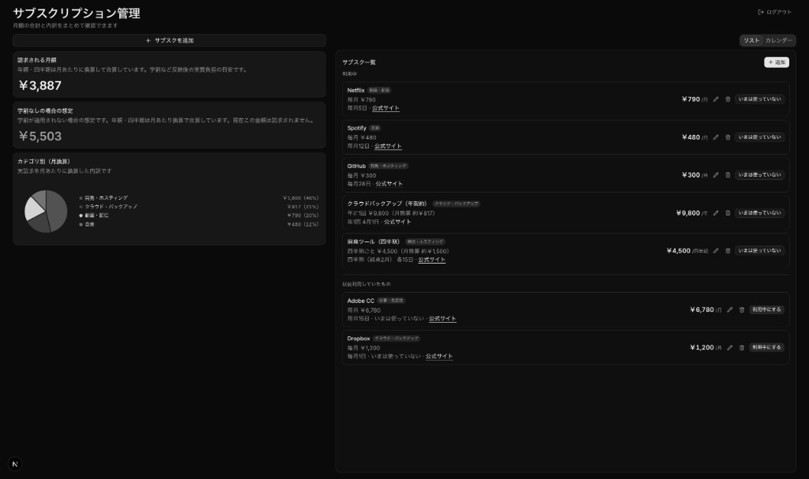

# サブスクリプション管理

月額のサブスクリプション支出を一覧し、カテゴリ別の内訳や次回請求日をまとめて把握するためのダッシュボードです。日本語 UI で、ダークテーマのカードレイアウトになっています。

## スクリーンショット



## 主な機能

- **月額換算の合計表示** — 年払い・四半期などを月あたりに換算した請求額の合計
- **学割なし想定額** — 割引適用前の想定額との比較（設定した場合）
- **カテゴリ別の内訳** — 円グラフと一覧で支出の割合を表示
- **サブスク一覧** — 利用中と「以前利用していたもの」を分けて管理
- **請求サイクル** — 月額／四半期／年額と次回請求日、公式サイトへのリンク
- **認証** — Convex Auth によるログイン（データはユーザーごとに保存）

## 技術スタック

| 領域 | 使用技術 |
|------|----------|
| フロント | [Next.js](https://nextjs.org/) 16（Turbopack）、[React](https://react.dev/) 19 |
| UI | [Tailwind CSS](https://tailwindcss.com/) 4、[shadcn/ui](https://ui.shadcn.com/)、[Radix UI](https://www.radix-ui.com/) |
| バックエンド / DB | [Convex](https://www.convex.dev/) |
| 認証 | [@convex-dev/auth](https://labs.convex.dev/auth) |
| 言語 | TypeScript |
| パッケージマネージャ | [Bun](https://bun.sh/)（`bun.lock`） |

## 前提条件

- [Bun](https://bun.sh/) がインストールされ、`bun` が PATH に通っていること
- [Convex](https://www.convex.dev/) アカウント（ローカル開発・デプロイ用）

## セットアップ

1. 依存関係のインストール

   ```bash
   bun install
   ```

2. 環境変数

   リポジトリ直下に `.env` を作成し、[`.env.example`](.env.example) を参考に設定します。

   - `NEXT_PUBLIC_CONVEX_URL` — Convex ダッシュボードのデプロイ URL
   - `SITE_URL` — 開発時は通常 `http://localhost:3000`（Convex Auth のリダイレクト用）

3. Convex の開発サーバーと Next.js

   別ターミナルで Convex を起動します。

   ```bash
   bun run convex:dev
   ```

   アプリ本体は次で起動します。

   ```bash
   bun run dev
   ```

   ブラウザで [http://localhost:3000](http://localhost:3000) を開きます。

本番では、Convex ダッシュボード側の `SITE_URL` なども実際のオリジンに合わせて設定してください。

## よく使うコマンド

| コマンド | 説明 |
|----------|------|
| `bun run dev` | 開発サーバー（Next.js + Turbopack） |
| `bun run build` | 本番ビルド |
| `bun run start` | 本番サーバー起動 |
| `bun run lint` | ESLint |
| `bun run typecheck` | TypeScript チェック（`tsc --noEmit`） |
| `bun run format` | Prettier で整形 |
| `bun run convex:dev` | Convex 開発同期 |
| `bun run convex:codegen` | Convex の型生成 |

## shadcn/ui コンポーネントの追加

```bash
npx shadcn@latest add button
```

追加されたコンポーネントは `components/ui` に配置されます。利用例:

```tsx
import { Button } from "@/components/ui/button"
```

## ライセンス

プライベートプロジェクト（`package.json` の `"private": true`）です。
